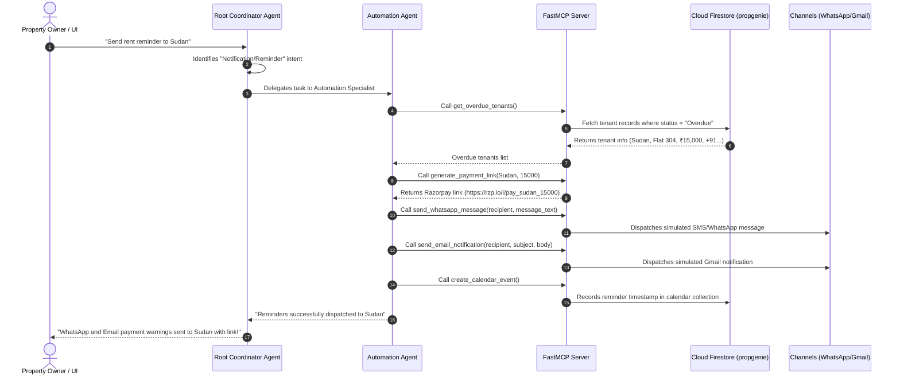

# Capstone PropGenie: AI-Powered Property Management Platform

PropGenie is an intelligent, autonomous property management system designed to coordinate property operations, financial logging, lease contracts, legal policies, and CDMX court eviction milestone tracking. It combines a state-of-the-art multi-agent coordinator backend with a premium glassmorphic React dashboard frontend.

---

## 🌟 Key Features

### 1. Unified Property & Tenant Management
* **Properties Directory**: Add, track, and manage properties.
* **Tenants Hub**: Manage tenant profiles, contact details, monthly rents, and payment statuses (`Paid` / `Overdue`).
* **Double-Submission Safety**: UI buttons are locked and disabled during submission to guarantee database consistency and eliminate double clicks.

### 2. Multi-Agent AI Coordinator Backend
* **Root Coordinator Agent**: Analyzes user prompts (natural language) and delegates tasks to domain-specific specialist agents.
* **Specialist Sub-Agents**:
  * **Automation Agent**: Manages rent overdue status calculations, schedules reminders, and dispatches email/WhatsApp notifications.
  * **Maintenance Agent**: Creates and tracks maintenance tickets, assigns vendors, and updates maintenance states.
  * **Finance Agent**: Records rental payments, logs repair expenses, and dynamically generates profit/loss (P&L) statements.
  * **Legal & Contract Agent**: Manages lease contracts drafting, signatures, renewals, terminations, legal policies, and eviction milestones.

### 3. Real-Time Operations Activity Feed
* Tracks and presents all backend actions (ticket changes, rent payments, warning alerts, properties added) in a live Activity Feed.
* **Smart Filter**: Read-only queries (like fetching financials or checking lists) are automatically ignored to keep the feed clean, action-focused, and free of noise.

### 4. Smart Rent Overdue & Lease Expiration Pipelines
* **5-Day Overdue Check**: If the date is within 5 days of the next month starting, active tenants who have not cleared their rent are dynamically marked `Overdue` in-memory.
* **Expirations**: Scans for contracts ending in $\le 30$ days and sends notifications to both Landlord and Tenant to coordinate renewals or vacating.
* **Run Auto Reminders**: A manual sidebar trigger runs this entire scanning and reminder-dispatching pipeline instantly.

### 5. Legal Protections & CDMX Eviction Milestones
* Displays active Legal Protection Policies and Credit Default Coverages.
* Stepper tracking for evictions in the **Tribunal Superior de Justicia de la CDMX (TSJCDMX)**:
  1. Notice Issued
  2. Lawsuit Filed
  3. Tenant Answer
  4. Trial Hearing
  5. Eviction Execution Order

### 6. Cloud Firestore Persistence
* Integrates a dedicated **Google Cloud Firestore Native Mode database** instance named `propgenie` for real-time persistence.
* **Per-Collection Seeding**: Seeds missing collections from `db.json` on startup.
* **Fallback Mode**: Gracefully falls back to local `db.json` when GCP credentials are not active (ensuring offline tests remain green).

---

## 🏗️ Architecture & Model Context Protocol (MCP)

PropGenie utilizes the **Model Context Protocol (MCP)** to expose python operation schemas directly to the LLM agent workspace. The system separates high-level intent orchestration, specialist tool coordination, and persistence drivers.

### System Diagram

```mermaid
graph TD
  UI[Vite React Frontend] -->|REST API| API[FastAPI Web Server]
  API -->|Session Manager| AGY[ADY Multi-Agent Orchestrator]
  AGY -->|Route Intents| RootAgent[Root Coordinator Agent]
  
  RootAgent -->|Delegate| Auto[Automation Agent]
  RootAgent -->|Delegate| Maint[Maintenance Agent]
  RootAgent -->|Delegate| Fin[Finance Agent]
  RootAgent -->|Delegate| Leg[Legal Agent]

  subgraph MCP Framework (Model Context Protocol)
    Auto & Maint & Fin & Leg -->|Query Tools| MCPHost[FastMCP Server]
    MCPHost -->|Expose Tool Schemas| Tools[tools.py]
  end

  Tools -->|Read / Write| Firestore[(GCP Cloud Firestore)]
  Tools -->|Fallbacks| DB[local db.json]
```

### 📩 Send Notification Agent Flow

When a user requests a rent payment reminder or lease warning, the multi-agent system executes the following sequential pipeline:



---

## 🛠️ Project Setup & Installation

### Prerequisites
* Python 3.11 or 3.12 (with `uv` package manager installed)
* Node.js (v18+)
* `gcloud` CLI authenticated with project access

### 1. Backend Server Setup
1. Navigate to the backend directory:
   ```bash
   cd propgenie
   ```
2. Install dependencies and synchronize python environment:
   ```bash
   uv sync
   ```
3. Run the FastAPI development server:
   ```bash
   uv run python -m app.fast_api_app
   ```
   *The server starts on `http://localhost:8000`.*

### 2. Frontend Setup
1. Navigate to the frontend directory:
   ```bash
   cd frontend
   ```
2. Install Node packages:
   ```bash
   npm install
   ```
3. Start the Vite React development server:
   ```bash
   npm run dev
   ```
   *Open `http://localhost:5173` in your browser.*

### 3. Testing and Linting
Run formatting checks and the test suite:
```bash
cd propgenie
agents-cli lint --fix
uv run pytest
```
Run ADK agent evaluations:
```bash
agents-cli eval run
```
